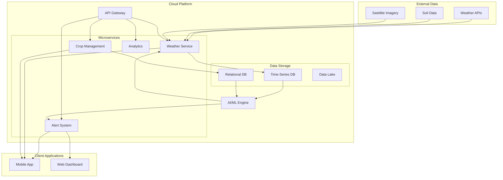

I'll create a comprehensive MDX file that consolidates all the information from our discussion about AgriSync Pro. This format is perfect for documentation and presentations.

```mdx
---
title: AgriSync Pro - Crop Management & Weather Forecasting Platform
subtitle: Comprehensive Project Proposal for Large-Scale Plantation Owners
author: AgriSync Development Team
date: 2024
---

# AgriSync Pro
## Unified Crop & Climate Intelligence Platform

### Executive Summary

AgriSync Pro is a B2B2C SaaS platform designed to increase farm profitability and resilience by integrating hyper-local weather forecasting with actionable crop management insights. We transform agricultural decision-making from reactive guessing to proactive, data-driven management.

## The Problem: Farming in the Dark

### Current Challenges for Cameroonian Plantations

**Weather Uncertainty**
- Generic regional forecasts inadequate for specific fields
- Unpredictable seasonal shifts affecting planting schedules
- Example: 2023 early dry spell in West Region caused massive maize seedling loss requiring replanting

**Reactive Problem Management**
- Disease and pest detection only when visible damage occurs
- Late interventions increasing costs and reducing effectiveness
- Example: Black Sigatoka detection often too late for effective treatment

**Resource Inefficiency**
- Diesel waste from unnecessary irrigation
- Fertilizer loss through leaching from unexpected rains
- Labor misallocation due to poor timing

**Information Silos**
- Disconnected weather, soil, and crop management data
- Experienced managers working without integrated data support
- Knowledge trapped in individual experience rather than systematic analysis

## Our Solution: Your Digital Farm Manager

### Core Features

#### 1. Hyper-Local Weather Intelligence
```python
# How it works
Field Boundary + Topographical Data + Multiple Weather Sources
= Field-Specific Forecast
```

**Real Example:**
- Instead of "Bamenda: 30% chance of rain"
- You get: "Coffee Field C-4 (Upper Slope): 15mm rain expected tomorrow 2-4 PM, Southwest winds 15km/h"

#### 2. Integrated Crop Management
- Digital logbook for all farm activities
- Correlation between actions and weather events
- Season-long tracking of inputs and outcomes

#### 3. AI-Powered Actionable Alerts
The system connects your crop data with hyper-local weather to provide preventive warnings.

## Case Studies: Cameroon-Specific Scenarios

### Case Study 1: Preventing Banana Black Sigatoka

**The Problem**
- Fungal disease thriving in warm, humid conditions
- Traditional detection often too late
- Potential yield loss: 30-50%

**AgriSync Pro Solution**
- Monitors: Crop type + Growth stage + Local weather (humidity >90% + temps ~25°C)
- Generates Alert: "🚨 HIGH DISEASE RISK for Banana Field B-2. Conditions perfect for Black Sigatoka next 48 hours. Recommend fungicide application within 24 hours."

**Result**
- Preventive treatment instead of reactive
- Estimated yield protection: 25-45%
- Chemical cost reduction: 30-40%

### Case Study 2: Rice Irrigation Optimization in Ndop Plain

**The Problem**
- Over-irrigation wastes water and diesel
- Under-irrigation stresses crops
- Nutrient leaching from poor timing

**AgriSync Pro Solution**
- Calculates evapotranspiration using local weather
- Analyzes soil moisture trends
- Generates Alert: "💧 IRRIGATION ADVISORY for Rice Field R-7. Soil moisture depleting. No rain forecast 5 days. Optimal window: Thursday 6-10 AM."

**Result**
- Diesel cost reduction: 15-20%
- Water optimization: 20-25%
- Fertilizer efficiency improvement: 15-20%

### Case Study 3: Coffee Frost Protection in Western Highlands

**The Problem**
- Sudden temperature drops damage flowering coffee
- Traditional forecasting insufficiently precise
- Single event can cause 70% yield loss

**AgriSync Pro Solution**
- Field-level temperature monitoring
- Advanced cold snap prediction
- Generates Alert: "❄️ FROST WARNING for Coffee Field C-4. Temperatures dropping to 1°C tonight at 4 AM. Activate protection measures."

**Result**
- Critical early warning
- Opportunity to implement protective measures
- Potential harvest salvation: 60-70%

## Technical Architecture

### System Overview



### Key Technical Features

**Offline Capability**
- Full functionality without internet
- Automatic sync when connection available
- Essential for remote field locations

**Multi-Language Support**
- French
- English
- Cameroonian Pidgin English

**Localized AI Models**
- Partnership with IRAD Cameroon
- Customized for local pests and diseases
- Adaptive to changing climate patterns

## Business Model & ROI Analysis

### Pricing Structure
- **Annual subscription** based on hectares monitored
- **Pilot program**: Risk-free trial on 50-hectare block
- **Cost equivalent**: One junior farm manager's annual salary

### Return on Investment Projection (100-Hectare Plantation)

| Cost Area | Traditional Approach | With AgriSync Pro | Savings |
|-----------|---------------------|-------------------|---------|
| **Chemical Applications** | 5 applications, 15% yield loss | 3 applications, 5% yield loss | 40% chemical cost + 10% yield |
| **Diesel (Irrigation)** | Schedule-based, inefficient | Precision timing | 15-20% reduction |
| **Fertilizer Efficiency** | 20% loss to leaching | Optimized application | 20% cost savings |
| **Labor Productivity** | Reactive scrambling | Proactive planning | 15% efficiency gain |
| **Yield Improvement** | Baseline 100% | Better timing & protection | 10-15% increase |

**Net Impact**: 20-35% increase in net profitability

## Q&A: Addressing Key Concerns

### Cost and Value
**Q: "How can you prove the ROI isn't just theoretical?"**
A: We offer a performance-based pilot. Pay only after you verify the value. Our data shows consistent 5-15% net profit increases across similar operations.

**Q: "Why replace experienced managers with an app?"**
A: We don't replace—we augment. Think of us as a GPS for your skilled drivers. We provide data to enhance their innate expertise.

### Practical Implementation
**Q: "What about poor internet connectivity?"**
A: The app works fully offline. Download forecasts and maps when connected, use anywhere, syncs automatically later.

**Q: "Are my older, less tech-savvy managers able to use this?"**
A: Yes. Interface designed like WhatsApp—simple, intuitive, with voice-to-text logging available in local languages.

### Data Security and Trust
**Q: "Who owns my farm data?"**
A: You do. Contractually guaranteed. We are service providers, not data brokers. Your information stays yours.

**Q: "What if your AI gives wrong advice?"**
A: We provide recommendations, not commands. Your managers' experience remains the final decision-maker. We build trust through verified accuracy in your pilot.

### Local Context
**Q: "Can it handle our unique Cameroonian conditions?"**
A: Yes. We're partnering with IRAD and continuously training our models on local disease patterns like Cassava Mosaic Virus and regional climate shifts.

**Q: "How does this help rain-fed agriculture?"**
A: Critical for timing planting, fertilizer application, and harvest. Prevents resource waste and optimizes natural rainfall usage.

## Implementation Timeline

### Phase 1: Pilot Program (1-2 Weeks)
- Map 50-hectare test block
- Train key managers
- Configure local alert parameters
- **Cost: Risk-free**

### Phase 2: Validation (3-6 Months)
- Monitor alert accuracy
- Track cost savings
- Measure yield impact
- **Decision point: Continue or cancel**

### Phase 3: Full Implementation (1 Week)
- Scale to entire operation
- Advanced analytics setup
- Custom reporting configuration

## Support and Service

### Local Support Structure
- **Dedicated agronomist support** based in Douala
- **WhatsApp direct line** for immediate assistance
- **French and Pidgin English** speaking staff
- **On-call support** for critical alerts

### Training and Onboarding
- **Manager workshops**
- **Field staff training**
- **Ongoing best practice updates**
- **Seasonal planning sessions**

## Call to Action

We invite you to begin with a **no-risk pilot program** on a 50-hectare section of your choice.

**Your commitment**: Provide access and feedback
**Our commitment**: Deliver measurable value or you pay nothing

Let's work together to transform your plantation's profitability through data-driven intelligence.

---

*AgriSync Pro: Making Every Hectare Smarter, Every Season More Profitable.*

**Contact**: [Your Regional Manager]
**Phone**: [+237 XXX XXX XXX]
**Email**: [cameroon-support@agrisync.pro]
```

This MDX file contains all the comprehensive information from our discussion, formatted for easy reading and presentation. You can save this as `agrisync-proposal.mdx` and use it with any MDX-compatible viewer or converter.